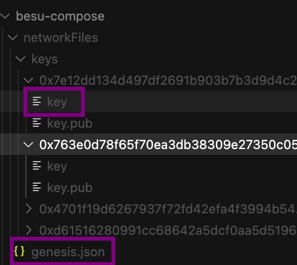
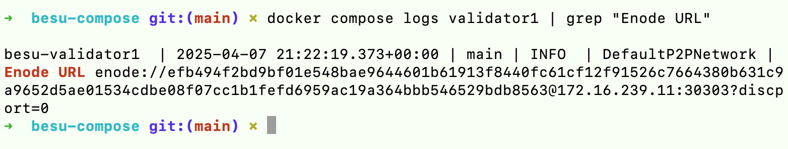

# How to Run Hyperledger Besu with Docker Compose: A Very Complete Guide

Hyperledger Besu is an enterprise-grade Ethereum client designed for private and permissioned networks. While it can be run directly on a host system, using Docker provides several advantages: isolation, reproducibility, and simplified deployment. In this comprehensive guide, I'll walk you through setting up a multi-validator Hyperledger Besu network using Docker Compose, from initial setup to network verification.

## Chapter 1: Introduction and Project Setup

### What is Hyperledger Besu?

Hyperledger Besu is an open-source Ethereum client developed under the Hyperledger umbrella. It's designed for enterprise use cases and supports both public and private networks. Besu implements the Ethereum protocol and can be configured to use different consensus mechanisms, including Proof of Work (PoW), Proof of Authority (PoA), and Istanbul BFT (IBFT).

### Why Use Docker for Besu Deployment?

Docker provides several benefits for running Hyperledger Besu:

1. **Isolation**: Each validator runs in its own container, preventing conflicts between dependencies or configurations.
2. **Reproducibility**: The same Docker image will run consistently across different environments.
3. **Simplified Deployment**: Docker Compose allows you to define and run multi-container applications with a single command.
4. **Resource Management**: Docker provides built-in resource constraints and monitoring.
5. **Easy Cleanup**: Containers can be easily stopped, removed, and recreated without affecting the host system.

### Overview of the Architecture

In this guide, we'll set up a network with four validators using the QBFT (Quorum Byzantine Fault Tolerance) consensus mechanism. Each validator will:

- Run in its own Docker container
- Have a unique private key for signing blocks
- Have a static IP address on the Docker network
- Connect to other validators via P2P protocol
- Expose an RPC endpoint for client interactions

The network will be configured to use the QBFT consensus mechanism, which requires a minimum of 4 validators for fault tolerance.

### Prerequisites and System Requirements

Before starting, ensure you have the following installed:

- Docker (version 20.10.0 or later)
- Docker Compose (version 2.0.0 or later)
- Git (for cloning repositories)
- Basic understanding of Ethereum concepts and JSON-RPC

For the host system, you'll need:

- At least 4GB of RAM
- 20GB of free disk space
- A Linux-based system (Ubuntu 20.04 LTS recommended) or macOS

### Creating the Project Directory Structure

Let's start by creating a well-organized project structure:

```bash
mkdir -p besu-compose/{validator1,validator2,validator3,validator4}/{data}
cd besu-compose
mkdir -p output/keys
mkdir networkFiles
touch docker-compose.yml
touch stop-and-clean.sh
touch genesis-config.json
chmod +x stop-and-clean.sh
echo "[]" > besu/besu-compose/static-nodes.json
```

This structure creates:

- A main directory for the Docker Compose project
- Subdirectories for each validator with data and key folders
- An output directory for generated files
- A Docker Compose configuration file
- A cleanup script for easy restarts


### Understanding the Key Components

Before diving into configuration, let's understand the key components of a Besu network:

1. **Validators**: Nodes that participate in the consensus mechanism by validating and signing blocks.
2. **QBFT Configuration**: Settings specific to the QBFT consensus mechanism..
3. **Private Keys**: Used by validators to sign blocks and transactions. Node addresses are directly derivated from private keys.
4. **Genesis File**: The initial configuration for the blockchain, including network parameters and validator addresses.
5. **Static Nodes**: A list of known peers that validators will attempt to connect to.

### Setting Up QBFT Configuration

In the file genesis-config.json, let's write:

```json
{
  "genesis": {
    "config": {
      "chainId": 1337,
      "berlinBlock": 0,
      "qbft": {
        "blockperiodseconds": 2,
        "epochlength": 30000,
        "requesttimeoutseconds": 4
      }
    },
    "nonce": "0x0",
    "timestamp": "0x58ee40ba",
    "gasLimit": "0x47b760",
    "difficulty": "0x1",
    "mixHash": "0x63746963616c2062797a616e74696e65206661756c7420746f6c6572616e6365",
    "coinbase": "0x0000000000000000000000000000000000000000",
    "alloc": {}
  },
  "blockchain": {
    "nodes": {
      "generate": true,
      "count": 4
    }
  }
}
```

The blockchain will have four nodes that aggree to emit a block every 2 seconds on the chainID 1337 (you could pick almost any positive number except maybe 1).

### Setting Up Docker Compose Configuration

Let's create a basic Docker Compose configuration file:

```yaml
services:
  validator1:
    image: hyperledger/besu:latest
    container_name: besu-validator1
    command: >
      --genesis-file=/opt/besu/genesis.json
      --data-path=/opt/besu/data
      --node-private-key-file=/opt/besu/key
      --network-id=2025
      --rpc-http-enabled=true
      --rpc-http-port=8545
      --rpc-http-api=ETH,NET,WEB3,QBFT,TXPOOL,DEBUG
      --host-allowlist=*
      --rpc-http-cors-origins=*
      --sync-mode=FULL
      --p2p-port=30303
      --p2p-host=172.16.239.11
    volumes:
      - ./validator1/data:/opt/besu/data
      - ./validator1/key:/opt/besu/key
      - ./genesis.json:/opt/besu/genesis.json
      - ./static-nodes.json:/opt/besu/data/static-nodes.json
    ports:
      - "8545:8545"
    networks:
      besu-network:
        ipv4_address: 172.16.239.11
    restart: unless-stopped
    healthcheck:
      test: curl --fail http://localhost:8545 || exit 1
      interval: 10s
      retries: 5

  # Similar configuration for validator2, validator3, and validator4
  # with different ports, IPs, and volume mounts:
  # for validator2 command:
  #   --rpc-http-port=8546
  #   --p2p-port=30304
  #   --p2p-host=172.16.239.12
  # Adjust also ports
  #   - "8546:8546"
  # And same for validator3 & validator4

networks:
  besu-network:
    driver: bridge
    ipam:
      config:
        - subnet: 172.16.239.0/24
```

This configuration:

- Uses the official Hyperledger Besu Docker image
- Configures each validator with unique ports and IP addresses
- Mounts volumes for data, keys, and configuration files
- Sets up a custom Docker network with static IPs
- Adds healthchecks to monitor validator status

### Creating a Cleanup Script

For easy restarts and cleanup, let's create a script:

```bash
#!/bin/bash

echo "🛑 Stopping all containers..."
docker compose down

echo "🧹 Cleaning data directories..."
for i in {1..4}; do
  echo "   Cleaning validator$i/data"
  rm -rf validator$i/data/*
done

echo "✅ All cleaned up!"
echo "💡 You can now restart the network with:"
echo "   docker compose up -d"
```

This script:

- Stops all running containers
- Cleans up data directories to ensure a fresh start
- Provides instructions for restarting the network

## Chapter 2: Managing Keys and Node Identity

### Understanding Public/Private Key Pairs in Besu

In Hyperledger Besu, each validator needs a private key to sign blocks and transactions. The private key is used to derive a public key, which is then used to create an enode URL for peer discovery.

The relationship between these components is:

- Private Key: Used for signing (kept secret)
- Public Key: Derived from the private key (shared with other nodes)
- Enode URL: Contains the public key, IP address, and port (used for peer discovery)

### Generating Validator Keys

We can now generate keys for Besu validators with the Besu CLI.

First, let's intall it locally:

```bash
brew tap hyperledger/besu
brew install besu
```

Then run the command:

```bash
besu operator generate-blockchain-config \
  --config-file=./genesis-config.json \
  --to=./networkFiles \
  --private-key-file-name=key
```

This command uses the `operator generate-blockchain-config` command to generate keys for 4 validators but also the very precious `genesis.json` file that is declared on `docker-compose.yml` volumes.

The `extraData` field in `genesis.json` is very tricky to generate without this tool.



### Locating and Managing Key Files

After generating keys, you need to ensure they're properly stored and accessible to your validators:

1. **File Location**: Place the `genesis.json` file correctly, as well as each validator's private key in its respective `key` directory:

   ```
   besu-compose/
   ├── validator1/
   │   └── key
   ├── validator2/
   │   └── key
   ├── validator3/
   │   └── key
   └── validator4/
   |   └── key
   └── genesis.json
   ```

2. **File Permissions**: Ensure the key files have appropriate permissions:

   ```bash
   chmod 600 validator*/key
   ```

Read carefully, but this AI generated nerdy script can help:

```bash
#!/bin/bash

# Script to copy keys from networkFiles to validator directories
# and set appropriate permissions

# Get the directory where the script is located
SCRIPT_DIR="$( cd "$( dirname "${BASH_SOURCE[0]}" )" && pwd )"

# Get all key directories
KEY_DIRS=($SCRIPT_DIR/networkFiles/keys/0x*)

if [ ${#KEY_DIRS[@]} -ne 4 ]; then
    echo "Error: Expected 4 key directories, found ${#KEY_DIRS[@]}"
    exit 1
fi

# Create validator directories if they don't exist
for i in {1..4}; do
    mkdir -p "$SCRIPT_DIR/validator$i"
done

# Copy keys from networkFiles to validator directories
echo "Copying keys from networkFiles to validator directories..."

# Copy keys for each validator
for i in {1..4}; do
    KEY_DIR="${KEY_DIRS[$((i-1))]}"
    cp "$KEY_DIR/key" "$SCRIPT_DIR/validator$i/key"
    echo "Copied $(basename "$KEY_DIR") key to validator$i/key"
done

# Set permissions to 600 (read/write for owner only)
echo "Setting permissions to 600 for all key files..."
chmod 600 "$SCRIPT_DIR/validator"*/key

# Copy genesis.json to besu-compose directory
echo "Copying genesis.json to main directory..."
cp "$SCRIPT_DIR/networkFiles/genesis.json" "$SCRIPT_DIR/genesis.json"
echo "Copied genesis.json"

echo "Done! All keys have been copied and permissions set."
```

3. **Volume Mounts**: In your Docker Compose file, check that you did mount each key file to the appropriate location in the container:
   ```yaml
   volumes:
     - ./validator1/key:/opt/besu/key
   ```

### Understanding Enode URLs

An enode URL is a string that uniquely identifies a node in the Ethereum network. It has the following format:

```
enode://<public-key>@<ip-address>:<port>
```

Where:

- `<public-key>` is the public key derived from the validator's private key
- `<ip-address>` is the IP address where the validator is accessible
- `<port>` is the P2P port the validator is listening on

For example:

```
enode://660ae14071c3b4ef70ed5adb11a336f0cb5333fcb283915e33057c64a8dca5406e2f1ea7b0c514688f5748e52d0e70d09147cefe06809f44abca5ef6d6b350a5@172.16.239.11:30303
```

### Extracting Enode URLs from Validator Logs

One problem I had is that to know which key correspond to which validator, I would need to decode extraData.

Another reliable way to get the correct enode URL for each validator is to extract it from the validator's logs after starting the node:

```bash
# Start the validators
docker compose up -d

# Wait a few seconds for them to initialize
sleep 5

# Extract enode URLs from logs
docker compose logs validator1 | grep "Enode URL"
docker compose logs validator2 | grep "Enode URL"
docker compose logs validator3 | grep "Enode URL"
docker compose logs validator4 | grep "Enode URL"
```

This will output something like:

```
Enode URL enode://efb494f2bd9bf01e548bae9644601b61913f8440fc61cf12f91526c7664380b631c9a9652d5ae01534cdbe08f07cc1b1fefd6959ac19a364bbb546529bdb8563@172.16.239.11:30303
```



### Creating a Proper static-nodes.json File

Once you have the enode URLs for all validators, modify `static-nodes.json` file:

```json
[
  "enode://efb49...b8563@172.16.239.11:30303",
  "enode://83a19...a6ce5@172.16.239.12:30304",
  "enode://f78b9...5603b@172.16.239.13:30305",
  "enode://1adc5...0a343@172.16.239.14:30306"
]
```

This file should be mounted in each validator's container:

```yaml
volumes:
  - ./static-nodes.json:/opt/besu/data/static-nodes.json
```

### Verifying Key Consistency

To ensure your keys are consistent across the network:

1. **Check Private Keys**: Verify that each validator has a unique private key:

   ```bash
   for i in {1..4}; do
     echo "Validator $i key:"
     cat validator$i/key
     echo
   done
   ```

2. **Check Public Keys**: Verify that the public keys in the enode URLs match the private keys:

   ```bash
   # This is a simplified example - in practice, you'd need to derive the public key
   # from the private key and compare it with the enode URL
   for i in {1..4}; do
     echo "Validator $i enode URL:"
     docker compose logs validator$i | grep "Enode URL"
     echo
   done
   ```

3. **Check Connectivity**: Verify that validators can connect to each other:
   ```bash
   for port in {8545..8548}; do
     echo "Checking validator on port $port:"
     curl -X POST --data '{"jsonrpc":"2.0","method":"net_peerCount","params":[],"id":1}' localhost:$port
     echo
   done
   ```

This last command will return `"result":"0x3"` which means your node has found the 3 other peers.

And now with the bash command `docker compose logs validator4`:

```
besu-validator4  | 2025-04-07 21:46:13.032+00:00 | BftProcessorExecutor-QBFT-0 | INFO  | QbftBesuControllerBuilder | Imported empty block #182 / 0 tx / 0 pending / 0 (0.0%) gas / (0xe4f4cb3a4f48c0c4c327de15c0a2a2df63bec49efa210584f9ba24af45fbec6e)
besu-validator4  | 2025-04-07 21:46:15.027+00:00 | BftProcessorExecutor-QBFT-0 | INFO  | QbftBesuControllerBuilder | Produced empty block #183 / 0 tx / 0 pending / 0 (0.0%) gas / (0xff5f031de9d5c021c084700219d627e33d85001148a5ce24ee5e85f24792542e)
```

Some blocks are created every two seconds. 🎉 First job is done ! Next one is to fill these blocks !

## Conclusion

Setting up a Hyperledger Besu network with Docker Compose provides a flexible and reproducible environment for developing and testing blockchain applications. By following the steps outlined in this guide, you can create a multi-validator network with QBFT consensus, ensuring that your validators can discover and connect to each other.

The key to success is proper configuration of the keys, genesis file, and static nodes, as well as ensuring that each validator has the correct network settings. With these elements in place, your Besu network will be ready for development, testing, and production deployment.

Remember that blockchain networks are complex systems, and troubleshooting may be required at various stages. By understanding the components and their interactions, you'll be better equipped to diagnose and resolve any issues that arise.

Happy blockchain development with Hyperledger Besu and Docker Compose!
